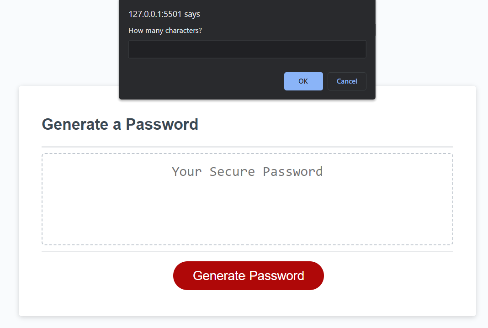
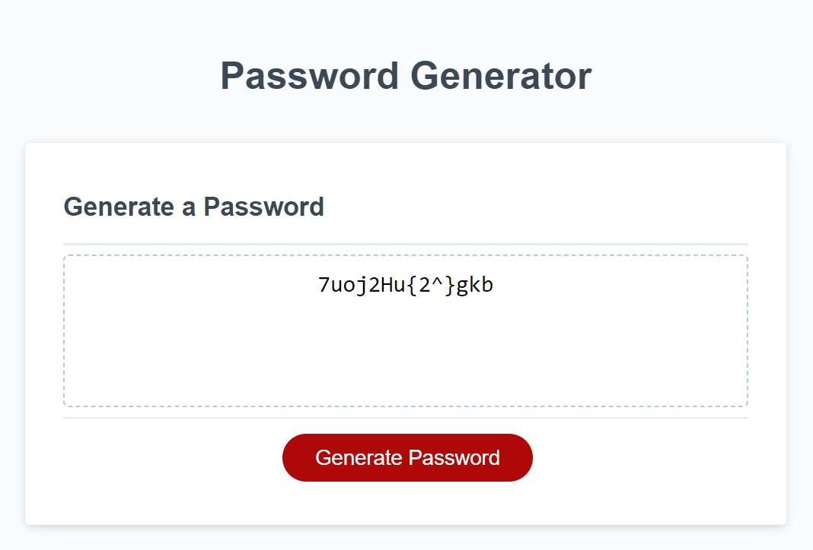

# Module 5 challenge password-generator
Task to fix the code for a tool to randomly generate a password.

## Description

I was given a code to randomly generate a password, which had to follow the following rules:
- At least 10 characters but no more than 64.
- Contain Lowercase
- Contain Uppercase
- Contain Number
- Contain Special characters

## Installation
Code was built on Visual Studio Code.
Click on following link to view website and github repository. Contains HTML and javascript file, and images in assets folder

## Usage
Click on generate password, and the tool will ask how many letters you require. The tool will not continue if you do not enter a number inbetween 10-64. The tool will then ask to confirm the inclusion of lowercase characters, uppercase characters, numbers and special characters. It will then return a randomly generated password.

## Deployment link:
[Completed challenge] (https://mtruong1995.github.io/password-generator/)

## Repo link:
[Repository] (https://github.com/mtruong1995/password-generator)

## Screenshot:

## Credit

-With help from https://fantastic-pudding.vercel.app/ and Drew from edx Web development course.
